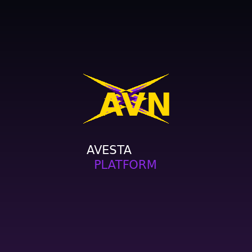
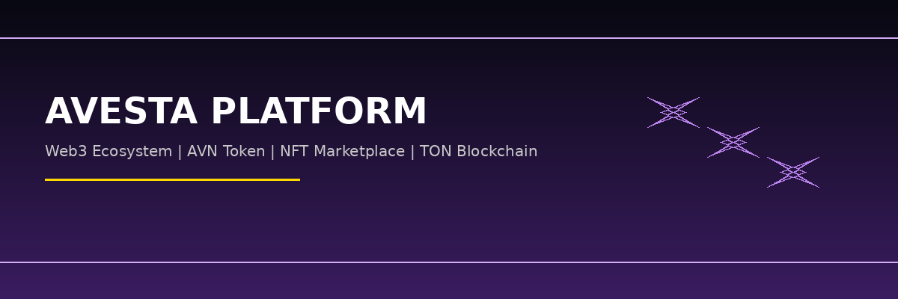

# 🚀 Avesta Platform

<p align="center">
  
</p>

<p align="center">
  <strong>Web3 Ecosystem | AVN Token | NFT Marketplace | TON Blockchain</strong>
</p>

<p align="center">
  
  
  
  
</p>

---

## 📋 Table of Contents

- [Overview](#overview)
- [Features](#features)
- [Technology Stack](#technology-stack)
- [Project Structure](#project-structure)
- [Getting Started](#getting-started)
- [Tokenomics](#tokenomics)
- [API Documentation](#api-documentation)
- [Contributing](#contributing)
- [License](#license)

---

## 🌟 Overview

**Avesta Platform** is a complete Web3 ecosystem built on TON Blockchain featuring:

- 🪙 **AVN Token** - Native cryptocurrency with 21B supply
- ⛏️ **Mining System** - Pi Network style 24-hour mining
- 🎨 **NFT Marketplace** - AI-generated NFT collections
- 💰 **Staking & DeFi** - Passive income through staking
- 🏛️ **DAO Governance** - Community-driven decisions
- 🤖 **AI Integration** - Smart recommendations & content
- 📱 **Telegram Mini App** - Full Web3 experience in Telegram

---

## ✨ Features

### Core Features

| Feature | Description | Status |
|---------|-------------|--------|
| 🔐 Authentication | JWT + TON Wallet + Telegram | ✅ |
| 💼 Wallet | AVN + TON multi-asset wallet | ✅ |
| ⛏️ Mining | 24h sessions with ads boost | ✅ |
| 🎡 Lucky Spin | Free spins + ad-based spins | ✅ |
| 🎨 NFT Marketplace | AI-generated collections | ✅ |
| 📊 Staking | Multiple plans with APY | ✅ |
| 🏛️ DAO | Proposal & voting system | ✅ |
| 👥 Referral | Multi-level 10%/5%/2% | ✅ |
| 🎮 Gamification | XP, levels, achievements | ✅ |
| 🤖 AI Assistant | Smart support & analytics | ✅ |

### Security Features

- 🔒 Multi-signature wallets
- 🛡️ Anti-fraud detection
- 🔐 Device fingerprinting
- 📊 Rate limiting
- 🚨 Real-time monitoring

---

## 🛠 Technology Stack

### Backend
- **FastAPI** - High-performance Python framework
- **SQLAlchemy** - ORM for PostgreSQL
- **Alembic** - Database migrations
- **Redis** - Caching & sessions
- **Celery** - Background tasks
- **WebSocket** - Real-time updates

### Frontend
- **React 18** - UI library
- **Vite** - Build tool
- **TailwindCSS** - Styling
- **Framer Motion** - Animations
- **i18next** - Multi-language support

### Blockchain
- **TON Network** - Primary blockchain
- **TON Connect** - Wallet integration
- **Smart Contracts** - FunC/Tact

### AI & ML
- **Stable Diffusion** - NFT image generation
- **LLM** - AI assistant & content
- **TensorFlow** - Fraud detection

---

## 📁 Project Structure

```
avesta-platform/
├── backend/              # FastAPI Backend
│   ├── app/
│   │   ├── api/         # API endpoints
│   │   ├── blockchain/  # Blockchain engine
│   │   ├── core/        # Security & config
│   │   ├── models/      # Database models
│   │   ├── services/    # Business logic
│   │   └── utils/       # Utilities
│   ├── alembic/         # Migrations
│   └── tests/           # Test suite
│
├── frontend/            # React Web App
│   ├── src/
│   │   ├── components/  # UI components
│   │   ├── pages/       # Page components
│   │   ├── services/    # API services
│   │   └── hooks/       # Custom hooks
│   └── public/          # Static assets
│
├── telegram-mini-app/   # Telegram Mini App
│   ├── pages/           # Mini app pages
│   └── components/      # Mini app components
│
├── admin-panel/         # React Admin Dashboard
│   ├── src/
│   │   ├── pages/       # Admin pages
│   │   └── components/  # Admin components
│
├── bot/                 # Telegram Bot
│   ├── bot.py           # Main bot
│   ├── commands.py      # Bot commands
│   └── handlers.py      # Message handlers
│
└── docs/                # Documentation
    └── images/          # Project images
```

---

## 🚀 Getting Started

### Prerequisites

- Python 3.11+
- Node.js 18+
- PostgreSQL 15+
- Redis 7+
- Docker (optional)

### Backend Setup

```bash
cd backend

# Create virtual environment
python -m venv venv
source venv/bin/activate  # Linux/Mac
# or
venv\Scripts\activate  # Windows

# Install dependencies
pip install -r requirements.txt

# Setup environment
cp .env.example .env
# Edit .env with your settings

# Run migrations
alembic upgrade head

# Start server
uvicorn app.main:app --reload
```

### Frontend Setup

```bash
cd frontend

# Install dependencies
npm install

# Start development server
npm run dev
```

### Telegram Bot Setup

```bash
cd bot

# Install dependencies
pip install -r requirements.txt

# Set bot token
export TELEGRAM_BOT_TOKEN=your_token

# Start bot
python bot.py
```

### Docker Setup (Recommended)

```bash
# Start all services
docker-compose -f docker-compose.prod.yml up -d

# View logs
docker-compose logs -f
```

---

## 🪙 Tokenomics

### AVN Token Distribution

| Allocation | Percentage | Amount | Purpose |
|------------|-----------|--------|---------|
| Mining Rewards | 45% | 9,450,000,000 | User mining rewards |
| Community & Referral | 10% | 2,100,000,000 | Community growth |
| Liquidity & Exchange | 10% | 2,100,000,000 | DEX liquidity |
| Team | 10% | 2,100,000,000 | Development team |
| DAO Treasury | 10% | 2,100,000,000 | Governance treasury |
| Marketing | 7% | 1,470,000,000 | Marketing campaigns |
| Ecosystem | 8% | 1,680,000,000 | Ecosystem development |

**Total Supply: 21,000,000,000 AVN**

### Mining Economics

- **Base Rate**: 0.25 AVN/hour
- **Daily Reward**: 6 AVN (24h session)
- **Ads Boost**: +2% per ad (max 5 ads = 10% boost)
- **Referral Bonus**: Level 1: 10%, Level 2: 5%, Level 3: 2%

---

## 📚 API Documentation

### Authentication

```
POST /api/auth/register    - User registration
POST /api/auth/login       - User login
GET  /api/auth/profile     - User profile
POST /api/auth/refresh     - Refresh token
```

### Wallet

```
GET  /api/wallet           - Get wallet info
POST /api/wallet/transfer  - Transfer AVN
GET  /api/wallet/history   - Transaction history
```

### Mining

```
POST /api/mining/start     - Start mining session
GET  /api/mining/status    - Mining status
POST /api/mining/claim     - Claim rewards
POST /api/mining/boost     - Watch ad for boost
```

### NFT

```
GET  /api/nft              - List NFTs
GET  /api/nft/{id}         - NFT details
POST /api/nft/create       - Create NFT
POST /api/nft/buy          - Buy NFT
POST /api/nft/sell         - Sell NFT
```

Full API documentation: [API.md](docs/API.md)

---

## 🤝 Contributing

We welcome contributions! Please see our [Contributing Guide](CONTRIBUTING.md) for details.

### Development Workflow

1. Fork the repository
2. Create feature branch (`git checkout -b feature/amazing-feature`)
3. Commit changes (`git commit -m 'Add amazing feature'`)
4. Push to branch (`git push origin feature/amazing-feature`)
5. Open Pull Request

---

## 📄 License

This project is licensed under the MIT License - see [LICENSE](LICENSE) file.

---

## 🔗 Links

- 🌐 Website: [https://avesta.app](https://avesta.app)
- 💬 Telegram: [https://t.me/AvestaBot](https://t.me/AvestaBot)
- 🐦 Twitter: [https://twitter.com/AvestaPlatform](https://twitter.com/AvestaPlatform)
- 📖 Docs: [https://docs.avesta.app](https://docs.avesta.app)

---

<p align="center">
  <strong>Built with ❤️ by Avesta Team</strong>
</p>

<p align="center">
  
</p>
